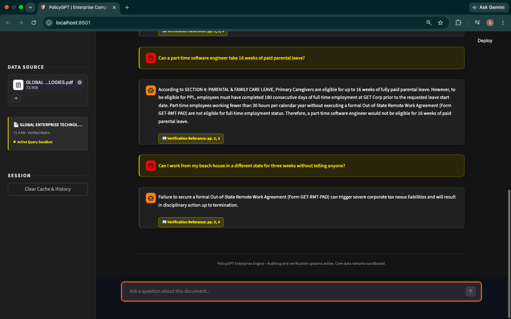

# 🤖 PolicyGPT: Enterprise Document Assistant

A lightning-fast, ultra-lightweight enterprise **Retrieval-Augmented Generation (RAG)** application built entirely in pure Python. It extracts text from policy PDFs, retrieves the most relevant clauses, and generates structured compliance-focused responses using the **Groq API**.

Designed with a premium enterprise-inspired interface featuring clean dashboards, dynamic welcome screens, document citations, and a seamless user experience.

---

## 🛠️ Tech Stack


---

## 📁 Project Structure

```text
PolicyGPT/
│
├── .streamlit/
│   └── secrets.toml      # API keys (ignored by Git)
├── app.py                # Streamlit application
├── rag.py                # Native Python RAG pipeline
├── requirements.txt      # Project dependencies
└── README.md             # Documentation
```

---

## 🚀 Features

### 🏢 Premium Enterprise UI

- Clean, enterprise-inspired interface.
- Dynamic welcome screen with quick-start suggestions.
- Toast notifications for successful document uploads.
- Responsive chat interface with modern styling.

### 📄 Intelligent PDF Processing

- Upload and analyze policy documents instantly.
- Automatic text extraction from PDFs.
- Efficient document chunking for accurate retrieval.
- Supports multiple policy documents.

### 🧠 Lightweight Native RAG Engine

- Pure Python implementation.
- No FAISS, ChromaDB, Torch, or Sentence Transformers required.
- Fast keyword-frequency retrieval pipeline.
- Optimized for modern Python environments.

### 💬 AI-Powered Compliance Assistant

- Answers questions strictly from uploaded documents.
- Handles greetings and conversational prompts naturally.
- Prevents hallucinations by grounding responses in source documents.
- Powered by Groq's high-speed LLM inference.

### 📚 Source Citations

- Displays page numbers used to generate responses.
- Improves transparency and traceability.
- Makes policy verification easier.

### 🔐 Secure Configuration

- API keys stored securely using Streamlit Secrets.
- No API key input fields in the application.
- Git-safe workflow with `.gitignore`.

---

## ⚙️ Installation

### 1. Clone the Repository

```bash
git clone https://github.com/saikarthik2906/PolicyGPT.git
cd PolicyGPT
```

### 2. Install Dependencies

```bash
pip install -r requirements.txt
```

### 3. Configure Secrets

Create a `.streamlit/secrets.toml` file:

```toml
GROQ_API_KEY = "your_groq_api_key"
```

### 4. Run the Application

```bash
streamlit run app.py
```

The application will launch in your default browser.

---

## 🌐 Deployment

Deploy for free using **Streamlit Community Cloud**.

1. Push the project to GitHub.
2. Connect the repository to Streamlit Cloud.
3. Add your `GROQ_API_KEY` under **Secrets**.
4. Deploy with one click.

---

## 🎯 Project Highlights

- Enterprise-ready document question answering
- Retrieval-Augmented Generation (RAG)
- Groq LLM integration
- PDF document processing
- Secure secrets management
- Lightweight architecture
- Fast document retrieval
- Source-aware responses with page citations
- Modern Streamlit dashboard

---

## 📷 Screenshots

> Add screenshots of your application here.

Chat Interface |
  |

---

## 👨‍💻 Author

**Sai Karthik**

---

## ⭐ Support

If you found this project useful, consider giving it a ⭐ on GitHub.
